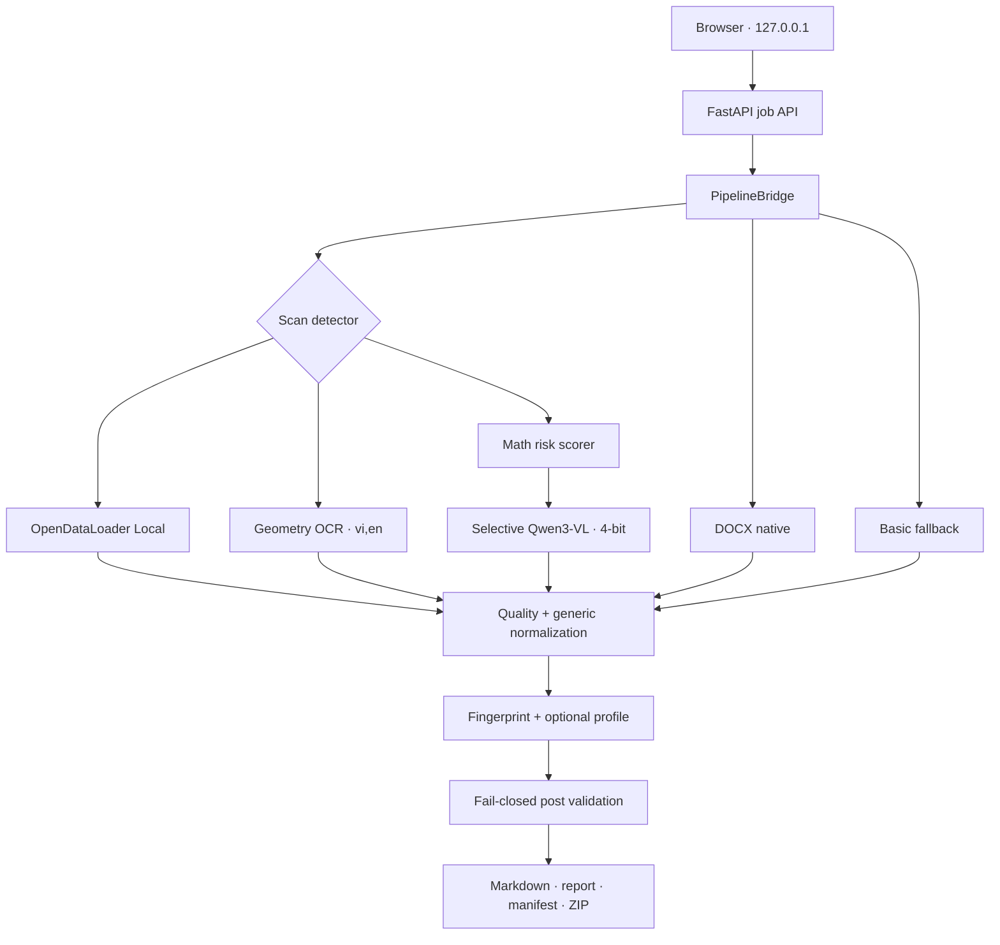

# Kiến trúc DocNorm MD

## Mục tiêu

DocNorm MD là lớp sản phẩm web bao quanh `pipeline_v2`. Giao diện chỉ biết một
khái niệm `job`; mọi chi tiết Stage 5/6/7 được cô lập trong `PipelineBridge`.



## Quyết định kiến trúc

1. Server chỉ bind `127.0.0.1`; không cần tài khoản và không gửi tài liệu ra
   Internet.
2. `venv_docnorm_web` chứa FastAPI và `pipeline_v2`; OpenDataLoader tiếp tục
   chạy trong `venv_opendataloader` qua subprocess argv, không trộn dependency.
3. Mỗi job có thư mục riêng và tên nguồn do server sinh, không dùng đường dẫn
   hoặc tên file làm lệnh hệ thống.
4. Một executor duy nhất tuần tự hóa tác vụ nặng để tránh chạy nhiều Java/Torch
   worker cùng lúc.
5. Normalization mặc định dùng quy tắc tổng quát. Profile quản lý vật tư chỉ
   được bật khi sáu fingerprint bắt buộc và ít nhất năm fingerprint bổ sung
   cùng khớp; lựa chọn `generic` luôn bỏ qua profile.
6. PDF được đo text layer trước khi convert. Bản scan chạy EasyOCR một lần trong
   môi trường GPU hiện có. Mỗi box được sắp theo tọa độ; OpenCV phát hiện đường
   ngang/dọc và ánh xạ chữ vào ô để dựng GFM table. Hybrid chỉ là fallback tùy
   chọn và không nạp sẵn.
7. Profile chuyên biệt chạy hậu kỳ trên Markdown, kiểm tra lại toàn bộ bảng GFM,
   thứ tự định nghĩa, lưu đồ, noise và heading footer. Không đạt bất kỳ invariant
   nào thì không xuất bản kết quả.
8. Worker Geometry tạo JSON riêng, cập nhật tiến độ từng trang và web xác minh
   source SHA256. Engine được ghi `EASYOCR_GEOMETRY`; một job scan chỉ tính một
   OCR invocation.
9. Tài liệu toán có text layer đi fast path trước. Risk scorer dùng nội dung đã
   gắn page provenance để chỉ chọn trang có ma trận/nhãn A–D bất thường; mặc
   định tối đa 8 trang. Qwen được nạp một lần trong subprocess độc lập.
10. Tài liệu toán scan chỉ đi thẳng Qwen khi người dùng chọn profile Đề toán.
    Validator so output với text layer (nếu có), chặn lặp dòng/khối, mất câu,
    thiếu A–D, output phình và LaTeX lệch. Job có trang không đạt sẽ dừng trước
    khi tạo artifact.

## Hợp đồng API

| Method | Route | Mục đích |
|---|---|---|
| GET | `/api/health` | Kiểm tra khả năng engine |
| POST | `/api/jobs` | Upload và tạo job |
| GET | `/api/jobs` | Lịch sử cục bộ |
| GET | `/api/jobs/{id}` | Trạng thái và tiến trình |
| GET | `/api/jobs/{id}/result` | Markdown và báo cáo |
| PATCH | `/api/jobs/{id}/markdown` | Lưu chỉnh sửa |
| GET | `/api/jobs/{id}/download/{artifact}` | Tải MD/JSON/ZIP |
| DELETE | `/api/jobs/{id}` | Xóa input và output của job |

## Trạng thái job

```text
QUEUED -> RUNNING/EXTRACT -> VERIFY -> NORMALIZE -> DONE/COMPLETED
                                                 -> DONE/FAILED
```

Job đang chạy khi server khởi động lại được chuyển thành `FAILED` với mã
`SERVER_RESTARTED`; completed job vẫn đọc được từ `job.json`.
